# Banner Ads ‎

Banner ads are rectangular image or text ads that occupy a spot-on screen. They stay on screen while users are interacting with the app.

In this section we will explain how to create and manage banner ad profiles in the AdKit manager. Also, we will provide list of functions and code snippets, alongside with example project code. 
 

!> **Prerequisites:**  
•	Installed and enabled one or more ad networks, which support banner ads.

## Settings

In this section we will explain banner settings which will apply for all banner profiles.

1.	In the AdKit manager select “Banner Ads” field and enable it.

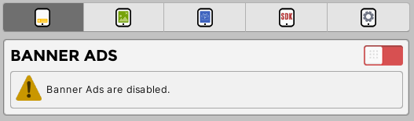

2.	If the project has no ad network which support banner ads, then the message with warning about missing ad networks. To access banner ads, project must have at least one ad network, which support banner ads, enabled.
 
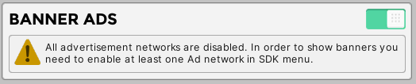

3.	After enabling banner ads all functions will become available and banner ads will be ready to be shown on the app.
 
  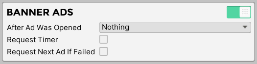

  1.	After Ad Was Opened – following actions can be done after banner ad has been opened.
        1.	Nothing – nothing will happen, banner ad will still be shown.
        2.	Hide – banner ad will be hidden.
        3.	Destroy Network – active banner ad network will be destroyed.
        4.	Request Next – following banner ad network will be requested according to selected mediation type.
        5.	Show Next - following banner ad network will be requested according to selected mediation type and after request finished, the banner ad will be shown.

?> **Quick Tip:**  
•	Unity Ads does not support on banner open event. Therefore, After Ad Was Opened functions will not work for this network.

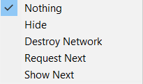

  2.	Request Timer – Request will be considered as failed if it will not be finished after the specified period.
    1.	Wait for Request - how long to wait for request to finish before canceling request (Seconds).

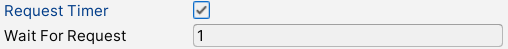

  3.	Request Next Ad If Failed – if banner ad fails to load then following banner ad network will be requested according to selected mediation type.


## Profile

In this section we will explain how to create and setup new banner profile.

1.	Select “New Banner Profile” button to create new banner profile.
 
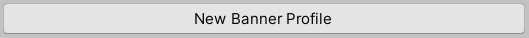

2.	Section with new banner profile will appear.

  1.	Banner profile name.
  2.	Copy banner profile name.
  3.	Duplicate banner profile.
  4.	Minimize banner profile.
  5.	Delete banner profile.

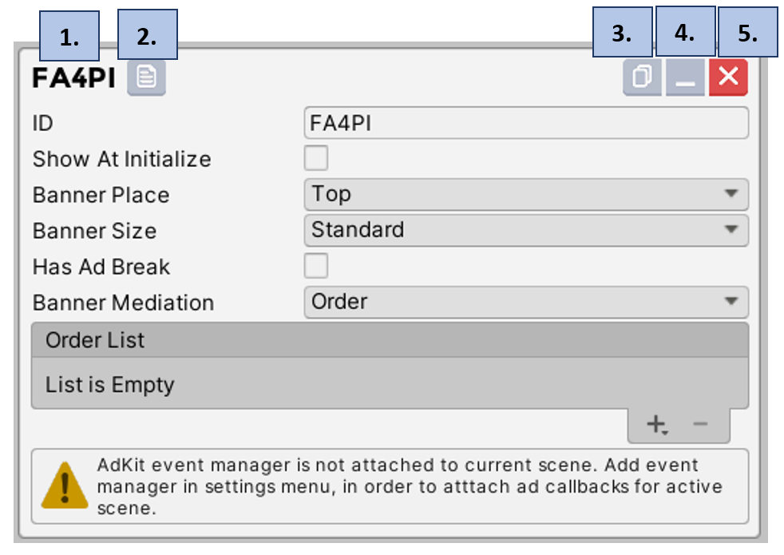

## Profile ID 

Used when calling specific ad profile.

##	Show at Initialize

 Display banner when AdKit is initialized.

```csharp
//(AdKitBanner) Returns banner that has been created when plugin initialized.
AdKitGeneral.GetShowAtInitializeBanner();
```
  
##	 Banner Place 

Includes 7 different places where banner ad can be displayed on the screen.

?> **Quick Tip:**  
•	Facebook and IronSource only supports top and bottom positions. Therefore, banner will be displayed according to selected banner place:   
‎ ‎ ‎o	(Top Left/Middle/Right) -> Top.  
‎ ‎ ‎o	(Center, Bottom Left/Middle/Right) -> Bottom.

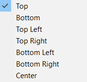

##	Banner Size

Includes 2 sizes to choose between.
  
?> **Quick Tip:**  
•	Unity Ads and AdColony does not support large banner size. Therefore, plugin will automatically display standard banner size for both networks. 


##	Ad Break 

Banner requests will be disabled for a custom amount of time, requests or until the exit of the game.
  
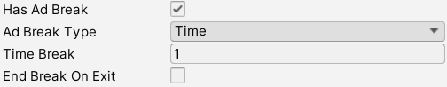 
  
1.	Ad Break Type – ad break can last for a custom time/request amount or until player exits app. 


2.	Time/Request Break – how long (minutes/requests) banner request will be disabled.
3.	End Break on Exit – Ad break will end when player exits app. If disabled, ad break will be active after restarting app. 

##	Banner Mediation 

In what order banner ad networks will be requested.
  


1.	Order – manually selected order in which banner networks will be requested.

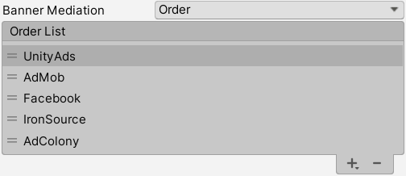

2.	Percent – banner networks will be requested according to the percentages indicated for each network. The higher the percentage, the higher number of ads will be requested from the network.

  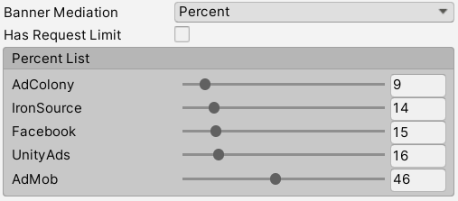

  1.	Has Request Limit – Same network can be requested only for custom amount of times. After the limit is reached, new network from the list will be requested.
        1.	Network Show Limit – How many times same network ad can be shown.

  

3.	Random – plugin randomly selects ad network.

  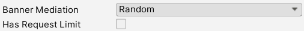

  1.	Has Request Limit – Same network can be requested only for custom amount of times. After the limit is reached, new network from the list will be requested.
        1.	Network Show Limit – How many times same network ad can be shown.

  

## API

In this section we will explain all the code for banner ads which is provided by this plugin.


### Enabled In The Project

Check if banner ads are enabled in the project.

!> **Prerequisites:**  
•	Initialized scene manager.

```csharp
//Get banner ads state in the project.
AdKitGeneral.AreBannerAdsEnabled();
```

### Create

First step towards displaying banner ad is to create AdKitBanner object.

!> **Prerequisites:**  
•	Initialized scene manager.
•	Enabled banner ads in manager.

```csharp
//Create banner ad.
AdKitBanner adKitBanner = new AdKitBanner("PROFILE ID");
```

### Pre-Request

Following functions can be called when banner ad is not requested.

```csharp
//Previous ad network.
//---Prerequisites---
//Banner ad mediation must be order.
adKitBanner.Previous();

//Next ad network.
//---Prerequisites---
//Banner ad mediation must be order.
adKitBanner.Next();

//Start ad break.
//---Prerequisites---
//Banner ad break has to be enabled in the manager.
adKitBanner.StartAdBreak();

//End ad break.
//---Prerequisites---
//Banner ad break has to be enabled in the manager.
adKitBanner.EndAdBreak(); 
```

### Request

Requesting banner ad.

!> **Prerequisites:**  
•	Access to Internet connection.
•	Banner has not been requested earlier.

```csharp
//Request with banner ad profile parameters.
adKitBanner.Request();

//Request with custom parameters.(Script must include AdKit.Internal package)
Banner.Place customPlace = Banner.Place.Top;
Banner.Size customSize = Banner.Size.Large;
adKitBanner.Request(customPlace, customSize);
```

### Show

Showing requested banner ad.

?> **Quick Tip:**  
•	If show function is called before request is finished, plugin will wait for request to finish and then it will show the ad.

!> **Prerequisites:**  
•	Requested banner.

```csharp
//Show banner.
adKitBanner.Show();
```

### Hide

Hide banner ad

!> **Prerequisites:**  
•	Requested banner.

```csharp
//Hide banner.
adKitBanner.Hide();
```

### Destroy

You can select to destroy only network that has been requested or fully destroy AdKitBanner.

```csharp
//Destroy only banner ad network.
adKitBanner.DestroyNetwork();

//Fully destroy banner ad object.
adKitBanner.Destroy();
```

### Parameters

Following functions will return the various parameters about the banner profile. 

```csharp
//(bool) Check if banner is created and initialized.
adKitBanner.IsInitialized();

//(string) Get banner profile ID.
adKitBanner.GetProfileID();

//(Banner.Place) Get banner ad place on device screen.
adKitBanner.GetBannerPlace();

//(Banner.Size) Get banner ad size.
adKitBanner.GetBannerSize();

//(bool) Check if banner ad has ad break.
adKitBanner.HasAdBreak();

//(bool) Check if banner ad break is active.
adKitBanner.AdBreakActive();

//(bool) Check if banner ad break will end when exiting application.
adKitBanner.HasEndBreakOnExit();

//(AdBreak) Get banner ad break type.
adKitBanner.GetAdBreakType();

//(string) Get banner ad break end.
adKitBanner.GetAdBreakEnd();

//(bool) Check if banner ad has same network request limit.
adKitBanner.HasRequestLimit();

//(int) How much same network can be shown until the limit will be reached.
adKitBanner.RequestsLeftUntilLimit();

//(Banner.Mediation) Get banner ad mediation type.
adKitBanner.GetMediation();

//(bool) Check if banner ad is requested.
adKitBanner.IsRequested();

//(Banner.Network) Get requested banner ad network.
adKitBanner.GetRequestedNetwork();

//(bool)Check if banner ad is shown.
adKitBanner.IsShown();
```

### Sample Code

```csharp
using UnityEngine;
using AdKit;

public class BannerAdsExample : MonoBehaviour
{
    private AdKitBanner adKitBanner;

    void Start()
    {
        adKitBanner = new AdKitBanner("PROFILE ID");
    }

    public void RequestBanner()
    {
        if(adKitBanner != null && adKitBanner.IsInitialized())
        {
            adKitBanner.Request();
        }
    }

    public void ShowBanner()
    {
        if(adKitBanner.IsRequested())
        {
            adKitBanner.Show();
        }
    }

    public void HideBanner()
    {
        if(adKitBanner.IsRequested())
        {
            adKitBanner.Hide();
        }
    }        

    public void DestroyBannerNetwork()
    {
        if(adKitBanner.IsRequested())
        {
            adKitBanner.DestroyNetwork();
        }
    }
}
```