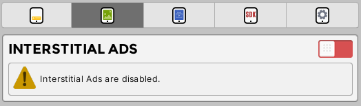
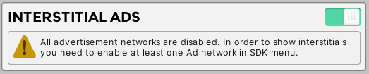
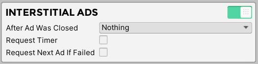
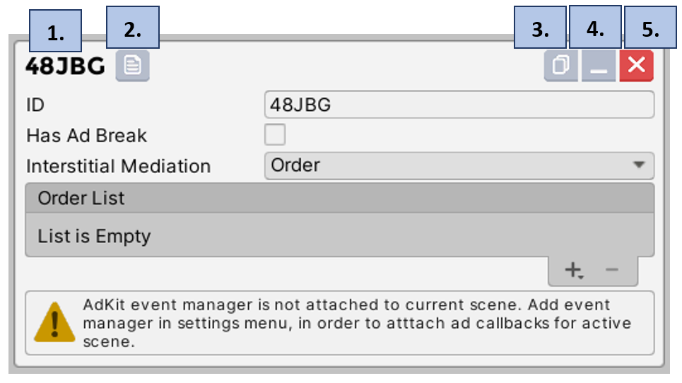
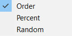
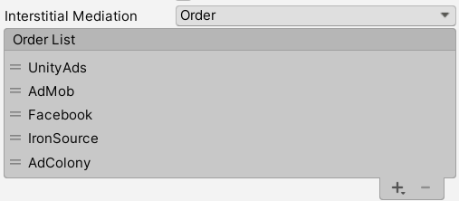
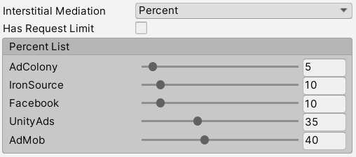
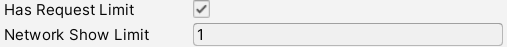

# Interstitial Ads

In this section we will explain how to create and manage interstitial ad profiles in the AdKit manager. Also, we will provide list of functions and code snippets, alongside with example project code. 

!> **Prerequisites:**  
•	Installed and enabled one or more ad networks, which support interstitial ads.

## Settings

In this section we will explain interstitial settings which will apply for all ad profiles.

1.	In the AdKit manager select “Interstitial Ads” field and enable it.



2.	If the project has no ad network which support interstitial ads, then the message with warning about missing ad networks. To access interstitial ads, project must have at least one ad network, which support interstitial ads, enabled.



3.	After enabling interstitial ads all functions will become available and interstitial ads will be ready to be shown on the app.

  

  1.	After Ad Was Closed – following actions can be done after interstitial ad has been closed.
        1.	Nothing – nothing will happen, interstitial ad will be closed.
        2.	Request Next – following interstitial ad network will be requested according to selected mediation type.


  2.	Request Timer – Request will be considered as failed if it will not be finished after the specified period.
        1.	Wait for Request - how long to wait for request to finish before canceling request (Seconds).


  3.	Request Next Ad If Failed – if interstitial ad fails to load then following interstitial ad network will be requested according to selected mediation type.


## Profile

In this section we will explain how to create and setup new interstitial profile.

1.	Select “New Interstitial Profile” button to create new interstitial profile.


2.	Section with new interstitial profile will appear.
  1.	Interstitial profile name.
  2.	Copy interstitial profile name.
  3.	Duplicate interstitial profile.
  4.	Minimize interstitial profile.
  5.	Delete interstitial profile.




## Profile	ID 

Used when calling specific ad profile.

##	Ad Break

Interstitial requests will be disabled for a custom amount of time, requests or until the exit of the game.

 
  
1.	Ad Break Type – ad break can last for a custom time/request amount or until player exits app. 


2.	Time/Request Break – how long (minutes/requests) interstitial will be locked from requests. 
3.	End Break on Exit – Ad break will end when player exits app. If disabled, ad break will be active after restarting app. 

##	Interstitial Mediation

In what order interstitial ad networks will be requested.
 


1.	Order – manually selected order in which interstitial networks will be requested.



2.	Percent – interstitial networks will be requested according to the percentages indicated for each network. The higher the percentage, the higher number of ads will be requested from the network.

  

  1.	Has Request Limit – Same network can be requested only for custom amount of times. After the limit is reached, new network from the list will be requested.
        1.	Network Show Limit – How many times same network ad can be shown.

  

3.	Random – plugin randomly selects ad network.

  

  1.	Has Request Limit – Same network can be requested only for custom amount of times. After the limit is reached, new network from the list will be requested.
        1.	Network Show Limit – How many times same network ad can be shown.

  

## API

### Enabled In The Project

Check if interstitial ads are enabled in the project.

!> **Prerequisites:**  
•	Initialized scene manager.

```csharp
//Get interstitial ads state in the project.
AdKitGeneral.AreInterstitialAdsEnabled();
```

### Create

First step towards displaying interstitial ad is to create AdKitInterstitial object.

!> **Prerequisites:**  
•	Initialized scene manager.
•	Enabled interstitial ads in manager.

```csharp
//Create interstitial ad
AdKitInterstitial adKitInterstitial = new AdKitInterstitial("PROFILE ID");
```

### Pre-Request

Following functions can be called when interstitial ad is not requested.

```csharp
//Previous ad network.
//---Prerequisites---
//Interstitial ad mediation must be order.
adKitInterstitial.Previous();

//Next ad network.
//---Prerequisites---
//Interstitial ad mediation must be order.
adKitInterstitial.Next();

//Start ad break.
//---Prerequisites---
//Interstitial ad break has to be enabled in the manager.
adKitInterstitial.StartAdBreak();

//End ad break.
//---Prerequisites---
//Interstitial ad break has to be enabled in the manager.
adKitInterstitial.EndAdBreak(); 
```

### Request

Requesting interstitial ad.

!> **Prerequisites:**  
•	Access to Internet connection.
•	Interstitial has not been requested earlier.

```csharp
//Request interstitial ad.
adKitInterstitial.Request();
```

### Show

Showing requested interstitial ad.

?> **Quick Tip:**  
•	If show function is called before request is finished, plugin will wait for request to finish and then it will show the ad.

!> **Prerequisites:**  
•	Requested interstitial.

```csharp
//Show interstitial ad.
adKitInterstitial.Show();
```

### Destroy

You can select to destroy only network that has been requested or fully destroy AdKitInterstitial object.

```csharp
//Destroy only interstitial ad network.
adKitInterstitial.DestroyNetwork();

//Fully destroy interstitial ad object.
adKitInterstitial.Destroy();
```

### Parameters

Following functions will return the various parameters about the interstitial profile.

```csharp
//(bool) Check if interstitial is created and initialized.
adKitInterstitial.IsInitialized();

//(string) Get interstitial profile ID.
adKitInterstitial.GetProfileID();

//(bool) Check if interstitial ad has ad break.
adKitInterstitial.HasAdBreak();

//(bool) Check if interstitial ad break is active.
adKitInterstitial.AdBreakActive();

//(bool) Check if interstitial ad break will end when exiting application.
adKitInterstitial.HasEndBreakOnExit();

//(AdBreak) Get interstitial ad break type.
adKitInterstitial.GetAdBreakType();

//(string) Get interstitial ad break end.
adKitInterstitial.GetAdBreakEnd();

//(bool) Check if interstitial ad has same network request limit.
adKitInterstitial.HasRequestLimit();

//(int) How much same network can be shown until the limit will be reached.
adKitInterstitial.RequestsLeftUntilLimit();

//(Interstitial.Mediation) Get interstitial ad mediation type.
adKitInterstitial.GetMediation();

//(bool) Check if interstitial ad is requested.
adKitInterstitial.IsRequested();

//(Interstitial.Network) Get requested interstitial ad network.
adKitInterstitial.GetRequestedNetwork();
```

### Sample Code

```csharp
using UnityEngine;
using AdKit;

public class InterstitialAdsExample : MonoBehaviour
{
    private AdKitInterstitial adKitInterstitial;

    void Start()
    {
        adKitInterstitial = new AdKitInterstitial("PROFILE ID");
    }

    public void RequestInterstitial()
    {
        if(adKitInterstitial != null && adKitInterstitial.IsInitialized())
        {
            adKitInterstitial.Request();
        }
    }

    public void ShowInterstitial()
    {
        if(adKitInterstitial.IsRequested())
        {
            adKitInterstitial.Show();
        }
    }

    public void DestroyInterstitialNetwork()
    {
        if(adKitInterstitial.IsRequested())
        {
            adKitInterstitial.DestroyNetwork();
        }
    }
}
```