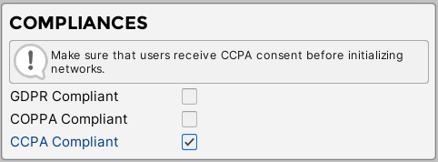
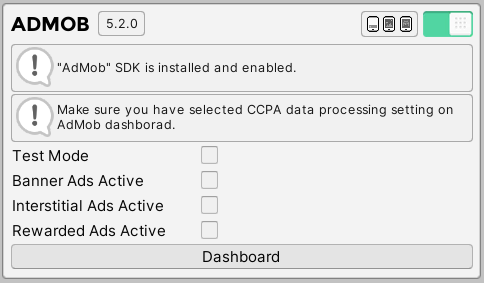
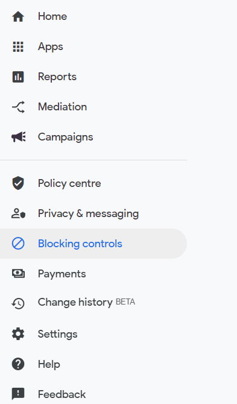
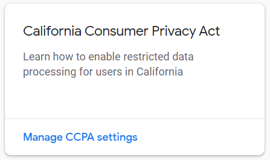
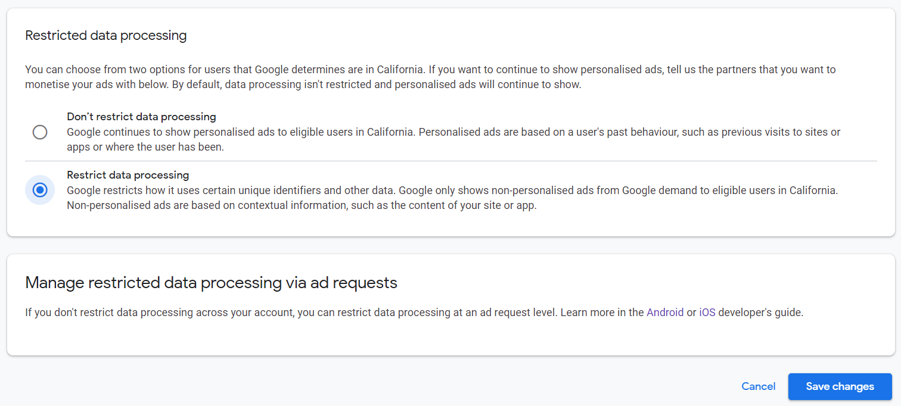

# CCPA Compliance

Our plugin does not collect any personal information. However, ad networks, which are available in this plugin does. Because of this, you need to provide more information for the user about available ad networks and what personal information they can collect. In this section we will explain all the steps that are needed to make your project CCPA compliant
 
?> **Quick Tip:**  
•	CCPA is valid only for ad networks that are available in this plugin. You will still need to provide privacy policy with information about which ad networks you are using in your app. If you still not sure if your app is CCPA compliant make sure to council with your lawyer.

## Enable CCPA Compliant
In this section we will explain how to enable CCPA compliant in the project.

?> **Quick Tip:**  
•	You can also enable CCPA compliant via code. It is useful if you are planning to check whether the user is from California. In this case you will be able to enable CCPA compliant only for Californian users. 
 
1.	Navigate to “SDK” menu and enable “CCPA Compliant” field.



### Setup AdMob

AdMob is the only network that requires manually setting up CCPA compliant using online dashboard. 

1.	After enabling CCPA in SDK section, navigate to “AdMob” section and open dashboard by pressing “Dashboard” button.



2.	Navigate to the “Blocking controls” field.



3.	Find CCPA section and select “Manage CCPA settings”



4.	In new page select “Restrict Data Processing” option and save changes.



## API

In this section we will provide all the function that are available for setting up CCPA.

### Get CCPA compliant state in the project

Check if CCPA compliant is enabled in the project.

!> **Prerequisites:**  
•	Initialized scene manager.

```csharp
AdKitGeneral.IsCCPACompliantEnabled();
```
 
### Manually set CCPA compliant state in the project

Set CCPA compliant state via code.
 
?> **Quick Tip:**  
•	This is useful if you are planning to enable COPPA compliant only for specific users.  

!> **Prerequisites:**  
•	Initialized scene manager.

```csharp
//Enable CCPA compliant in the project.
AdKitGeneral.SetCCPAompliant(true);

//Disable CCPA compliant in the project.
AdKitGeneral.SetCCPACompliant(false);
```

### Check User Consent

Check if user has consented CCPA compliant.

!> **Prerequisites:**  
•	Initialized scene manager.  
•	Enabled CCPA compliant.

```csharp
AdKitGeneral.UserHasConsentedCCPACompliant();
```

### Set User Consent
Set user CCPA consent to allow or disagree collecting personal information.

!> **Prerequisites:**  
•	Initialized scene manager.  
•	Enabled CCPA compliant.  
•	Networks cannot be initialized.

```csharp
//User allows to collect personal information.
AdKitGeneral.SetUserCCPAConsent(true);

//User disagree to collect personal information.
AdKitGeneral.SetUserCCPAConsent(false);
```
 
### Sample Code

```csharp
using UnityEngine;
using AdKit;

public class GDPRConsentExample : MonoBehaviour
{
    void Start()
    {
        if(AdKitGeneral.UserHasConsentedCCPACompliant() == false)
        {
            AskForCCPAConsent();
        }
    }
    //If user accepts -- CCPAConsentGiven(true);
    //If user declines – CCPAConsentGiven(false);
    public void CCPAConsentGiven(bool accepted)
    {
       AdKitGeneral.SetUserCCPAConsent(accepted); 
    } 
}
```