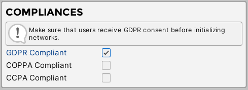

# GDPR Compliance

Our plugin does not collect any personal information. However, ad networks, which are available in this plugin does. Because of this, you need to provide additional information for the user about available ad networks and ask for consent allowing ad networks to collect personal information. In this section we will explain all the steps that are needed to make your project GDPR compliant.  

?> **Quick Tip:**  
•	GDPR is valid only for ad networks that are available in this plugin. You will still need to provide privacy policy with information about which ad networks you are using in your app. If you still not sure if your app is GDPR compliant make sure to council with your lawyer.

## Enable GDPR Compliant

In this section we will explain how to enable GDPR compliant in the project.

?> **Quick Tip:**  
•	You can also enable GDPR compliant via code. It is useful if you are planning to check whether the user is EU citizen or not. In that case you will be able to enable GDPR compliant only for EU citizens. 
 
1.	Navigate to “SDK” menu and enable “GDPR Compliant” field.



## API

In this section we will provide all the function that are available for setting up GDPR.

### Get GDPR compliant state in the project

Check if GDPR compliant is enabled in the project.

!> **Prerequisites:**  
•	Initialized scene manager.

```csharp
AdKitGeneral.IsGDPRCompliantEnabled();
```

### Manually set GDPR compliant state in the project

Set GDPR compliant state via code.

?> **Quick Tip:**  
•	This is useful if you are planning to enable GDPR compliant only for specific users. 

!> **Prerequisites:**  
•	Initialized scene manager.

```csharp
//Enable GDPR compliant in the project.
AdKitGeneral.SetGDPRCompliant(true);

//Disable GDPR compliant in the project.
AdKitGeneral.SetGDPRCompliant(false);
```

### Check User Consent

Check if user has consented GDPR compliant.

!> **Prerequisites:**  
•	Initialized scene manager.
•	Enabled GDPR compliant.

```csharp
AdKitGeneral.UserHasConsentedGDPRCompliant();
```

### Set  User Consent

Set user GDPR consent

!> **Prerequisites:**  
•	Initialized scene manager.
•	Enabled GDPR compliant.
•	Networks cannot be initialized.


```csharp
//User agreed to show personalized ads.
AdKitGeneral.SetUserGDPRConsent(true);

//User agreed to show non-personalized ads.
AdKitGeneral.SetUserGDPRConsent(false);
```

### Sample Code

```csharp
using UnityEngine;
using AdKit;

public class GDPRConsentExample : MonoBehaviour
{
    void Start()
    {
        if(AdKitGeneral.UserHasConsentedGDPRCompliant() == false)
        {
            AskForGDPRConsent();
        }
    }
    //If user accepts -- GDPRConsentGiven(true);
    //If user declines – GDPRConsentGiven(false);
    public void GDPRConsentGiven(bool accepted)
    {
       AdKitGeneral.SetUserGDPRConsent(accepted); 
    } 
}
```
