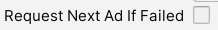
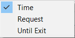

# Rewarded Ads

In this section we will explain how to create and manage rewarded ad profiles in the AdKit manager. Also, we will provide list of functions and code snippets, alongside with example project code.  

!> **Prerequisites:**  
•	Installed and enabled one or more ad networks, which support rewarded ads.

## Settings

In this section we will explain rewarded settings which will apply for all ad profiles.

1.	In the AdKit manager select “Rewarded Ads” field and enable it.


2.	If the project has no ad network which support rewarded ads, then the message with warning about missing ad networks. To access rewarded ads, project must have at least one ad network, which support rewarded ads, enabled.


3.	After enabling rewarded ads all functions will become available and rewarded ads will be ready to be shown on the app.

  

  1.	After Ad Was Closed – following actions can be done after rewarded ad has been closed.
        1.	Nothing – nothing will happen, rewarded ad will be closed.
        2.	Request Next – following rewarded ad network will be requested according to selected mediation type.


  2.	Request Timer – Request will be considered as failed if it will not be finished after the specified period.
        1.	Wait for Request - how long to wait for request to finish before canceling request (Seconds).


  3.	Request Next Ad If Failed – if rewarded ad fails to load then following rewarded ad network will be requested according to selected mediation type.



## Profile

**Ad Profiles** – using AdKit developers can create individual ad profiles for different use cases and launch them into the project. Each ad profile has integrated useful functions including ad breaks, mediation, events, etc.

In this section we will explain how to create and setup new rewarded profile.

1.	Select “New Rewarded Profile” button to create new rewarded profile.


2.	Section with new rewarded profile will appear.
  1.	Rewarded profile name.
  2.	Copy rewarded profile name.
  3.	Duplicate rewarded profile.
  4.	Minimize rewarded profile.
  5.	Delete rewarded profile.


## Profile	ID 

Used when calling specific ad profile.

##	Ad Break

Rewarded will be locked from requests for a custom amount of time or requests.

 
  
1.	Ad Break Type – ad break can last for a custom time/request amount or until player exits app. 



2.	Time/Request Break – how long (minutes/requests) rewarded will be locked from requests. 
3.	End Break on Exit – Ad break will end when player exits app. If disabled, ad break will be active after restarting app. **(Only when player exits using Application.Quit() method)**

##	Rewarded Mediation

**Mediation** – in each ad profile developers will have a chance to swap between different mediation types. Developers can create their own ad network order in which the ads will be shown or select to display ad networks by percentage or randomly.

In what order rewarded ad networks will be requested.
 


1.	Order – manually selected order in which rewarded ad networks will be requested.


2.	Percent – rewarded networks will be requested according to the percentages indicated for each network. The higher the percentage, the higher number of ads will be requested from the network.

  

  1.	Has Request Limit – Same network can be requested only for custom amount of times. After the limit is reached, new network from the list will be requested.
        1.	Network Show Limit – How many times same network ad can be shown.

  

3.	Random – plugin randomly selects ad network.

  

  1.	Has Request Limit – Same network can be requested only for custom amount of times. After the limit is reached, new network from the list will be requested.
        1.	Network Show Limit – How many times same network ad can be shown.

  

## API

### Enabled in The Project

Check if rewarded ads are enabled in the project.

!> **Prerequisites:**  
•	Initialized scene manager.

```csharp
//Get rewarded ads state in the project.
AdKitGeneral.AreRewardedAdsEnabled();
```

### Create

First step towards displaying rewarded ad is to create AdKitRewarded object.

!> **Prerequisites:**  
•	Initialized scene manager.  
•	Enabled rewarded ads in manager.

```csharp
//Create rewarded ad
AdKitRewarded adKitRewarded = new AdKitRewarded("PROFILE ID");
```

### Pre-Request

Following functions can be called when rewarded ad is not requested.

```csharp
//Previous ad network.
//---Prerequisites---
// Rewarded ad mediation must be order.
adKitRewarded.Previous();

//Next ad network.
//---Prerequisites---
// Rewarded ad mediation must be order.
adKitRewarded.Next();

//Start ad break.
//---Prerequisites---
//Rewarded ad break has to be enabled in the manager.
adKitRewarded.StartAdBreak();

//End ad break.
//---Prerequisites---
//Rewarded ad break has to be enabled in the manager.
adKitRewarded.EndAdBreak(); 
```

### Request

Requesting rewarded ad.

!> **Prerequisites:**  
•	Access to Internet connection.  
•	Rewarded has not been requested earlier.

```csharp
//Request rewarded ad.
adKitRewarded.Request();
```

### Show

Showing requested rewarded ad.

?> **Quick Tip:**  
•	If show function is called before request is finished, plugin will wait for request to finish and then it will show the ad.

!> **Prerequisites:**  
•	Requested rewarded ad.

```csharp
//Show rewarded ad.
adKitRewarded.Show();
```

### Destroy

You can select to destroy only network that has been requested or fully destroy AdKitRewarded object.

```csharp
//Destroy only rewarded ad network.
adKitRewarded.DestroyNetwork();

//Fully destroy rewarded ad object.
adKitRewarded.Destroy();
```

### Parameters

Following functions will return the various parameters about the rewarded profile.

```csharp
//(bool) Check if rewarded is created and initialized.
adKitRewarded.IsInitialized();

//(string) Get rewarded profile ID.
adKitRewarded.GetProfileID();

//(bool) Check if rewarded ad has ad break.
adKitRewarded.HasAdBreak();

//(bool) Check if rewarded ad break is active.
adKitRewarded.AdBreakActive();

//(bool) Check if rewarded ad break will end when exiting application.
adKitRewarded.HasEndBreakOnExit();

//(AdBreak) Get rewarded ad break type.
adKitRewarded.GetAdBreakType();

//(string) Get rewarded ad break end.
adKitRewarded.GetAdBreakEnd();

//(bool) Check if rewarded ad has same network request limit.
adKitRewarded.HasRequestLimit();

//(int) How much same network can be shown until the limit will be reached.
adKitRewarded.RequestsLeftUntilLimit();

//(Rewarded.Mediation) Get rewarded ad mediation type.
adKitRewarded.GetMediation();

//(bool) Check if rewarded ad is requested.
adKitRewarded.IsRequested();

//(Rewarded.Network) Get requested rewarded ad network.
adKitRewarded.GetRequestedNetwork();
```

### Sample Code

```csharp
using UnityEngine;
using AdKit;

public class RewardedAdsExample : MonoBehaviour
{
    private AdKitRewarded adKitRewarded;

    void Start()
    {
        adKitRewarded = new AdKitRewarded("PROFILE ID");
    }

    public void RequestRewarded()
    {
        if(adKitRewarded!= null && adKitRewarded.IsInitialized())
        {
            adKitRewarded.Request();
        }
    }

    public void ShowRewarded()
    {
        if(adKitRewarded.IsRequested())
        {
            adKitRewarded.Show();
        }
    }

    public void DestroyRewardedNetwork()
    {
        if(adKitRewarded.IsRequested())
        {
            adKitRewarded.DestroyNetwork();
        }
    }
}
```