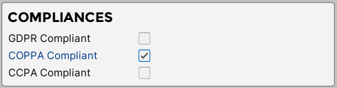
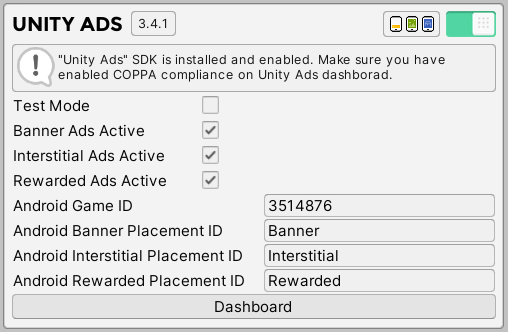
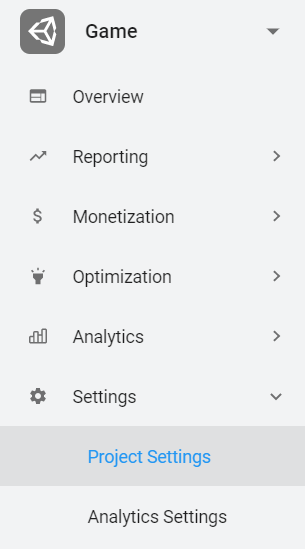
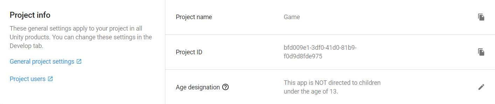
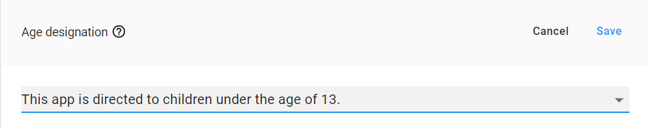
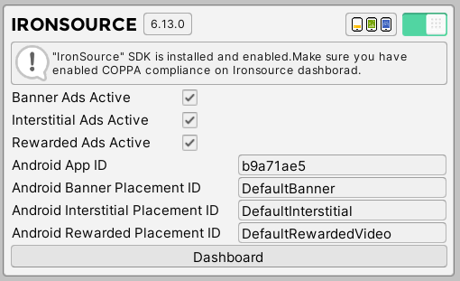
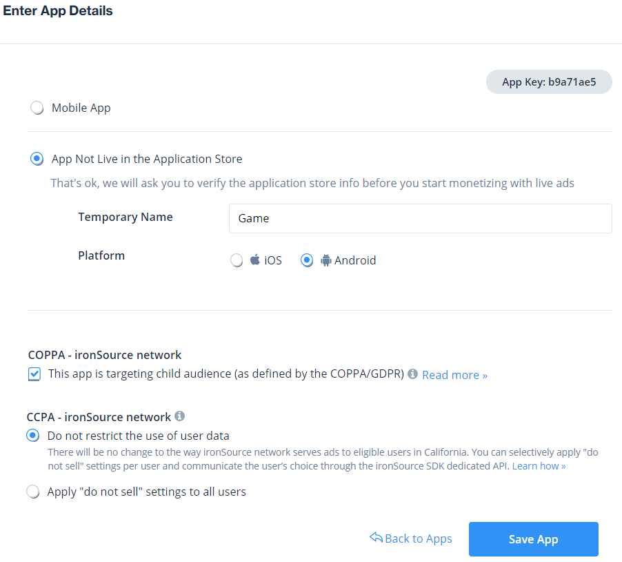

# COPPA Compliance

Our plugin does not collect any personal information. However, ad networks, which are available in this plugin does. Because of this, you need to provide more information for the user about available ad networks and what personal information they can collect. In this section we will explain all the steps that are needed to make your project COPPA compliant. 

?> **Quick Tip:**  
•	COPPA is valid only for ad networks that are available in this plugin. If you still not sure if your app is COPPA compliant make sure to council with your lawyer.

## Enable COPPA Compliant

In this section we will explain how to enable COPPA compliant in the project.

?> **Quick Tip:**  
•	You can also enable COPPA compliant via code. It is useful if you are planning to check whether the user is younger than 13 years old. In that case you will be able to enable COPPA compliant only for young users. 

1. Navigate to “SDK” menu and enable “COPPA Compliant” field.



## Setup Unity Ads

1.	After enabling COPPA in SDK section, navigate to “Unity Ads” section and open dashboard by pressing “Dashboard” button.



2.	Navigate to the project and select “Project settings” field.



3.	Find “Age designation” field and select edit button.



4.	In new window select “This app is directed to children under the age of 13” and click “Save” button.



## Setup IronSource

1.	After enabling COPPA in SDK section, navigate to “IronSource” section and open dashboard by pressing “Dashboard” button.



1.	At the bottom of the dashboard find your project and select edit button.


2.	Enable “COPPA” field and click “Save” button.



## API

In this section we will provide all the function that are available for setting up COPPA.

### Get COPPA compliant state in the project

!> **Prerequisites:**  
•	Initialized scene manager.

```csharp
AdKitGeneral.IsCOPPACompliantEnabled();
```

Check if COPPA compliant is enabled in the project.
 
### Manually set COPPA compliant state in the project

Set COPPA compliant state via code.

?> **Quick Tip:**  
•	This is useful if you are planning to enable COPPA compliant only for specific users.

!> **Prerequisites:**  
•	Initialized scene manager.

```csharp
//Enable COPPA compliant in the project.
AdKitGeneral.SetCOPPACompliant(true);

//Disable COPPA compliant in the project.
AdKitGeneral.SetCOPPACompliant(false);
```