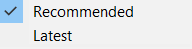

# AdColony

In this section we will explain how to install, enable and use AdColony ads with AdKit plugin. We will explain in detail on how to create new project in the AdColony dashboard and how to synchronize with the plugin.

!> **Prerequisites:**  
•	Registered AdColony account  
•	(iOS) Installed CocoaPods

## Installation

1. Select preferred SDK version:
  1. Recommended – this version is tested by our developers. Version is fully compatible with our plugin and other networks. Recommended version provides more functionality, including separate SDK folder where all recommended SDK will be installed. Also, we’re going to keep up to date the network with each plugin update.
  2. Latest – this version might be the newer version comparing to recommended version. However, this version might not be compatible with the current AdKit version. Only use this version if there is a need for it.

2. When SDK version has been selected press “Download SDK” button to download the plugin. In the top right corner ad formats, which are available in this plugin, are displayed:
  1. Yellow – banner ad.
  2. Green – interstitial ad.
  3. Blue – rewarded ad.

3. After importing the plugin, message with installed plugin will appear. Also, if you choose to download recommended version, next to the header will be displayed SDK version and “Uninstall SDK” button at the bottom which will allow you to quickly delete installed SDK.
  1. Version – which version is currently installed (Recommended version only).
  2. Available Ad Formats – which ad formats are available. After enabling specific ad format, specific icon will become colored.
  3. Active SDK – enable or disable SDK from AdKit plugin.
  4. Uninstall SDK – uninstall network from plugin. (Recommended version only).
  5. Dashboard – opens Unity Ads online dashboard.

4. Enable plugin and wait couple seconds for Unity Editor to finish loading files.

5. After plugin loading finished message with installed and enabled plugin will be displayed.
  1. Test Mode – AdColony provides test mode for each ad format. Enable it if you want to display test ads while developing.
  2.	Banner Ads Active – if enabled, AdColony network will be active to select for mediation in banner profiles.
  3.	Interstitial Ads Active – if enabled, AdColony network will be active to select for mediation in interstitial profiles.
  4.	Rewarded Ads Active – if enabled, AdColony network will be active to select for mediation in rewarded profiles.

6. ~(Android)~ Navigate to “Assets” and now select “External Dependency Manager”, expand “Android Resolver” and select “Force Resolve” button.

## New Project

In this section we will explain how to create project using IronSource dashboard and how to synchronize all IDs with the plugin.

1.	Visit https://clients.adcolony.com 
2.	In top toolbar select “Monetization”.

3.	Press “+ Setup New App” button.
 

4.	Select platform on which project is developed. If the project is developed on both platforms, then later you will need to setup second app with another platform. (Amazon is not compatible at this moment)

5.	Select if this game is localized to a specific country. If not, then select “Global” option. Fill in “App Name” field.  If the project is live on app store, then select “Search Store” button.

6.	Select what types of ads to show in the project and click “Create” button.

## Banner Ads‎‎‏‏‎‏‏‎ ‎

In this section we will explain how to create banner ad placement in AdColony dashboard and then synchronize it with AdKit Plugin. 

1.	In the top toolbar select “Monetization”.

2.	Select the project.

3.	Copy “AdColony App ID”. We will use it later in AdKit plugin.

4.	Press “+ Setup New Ad Zone” button.

 
5.	Fill in “Name your ad zone” field.

 
6.	Locate “Ad Zone Size” section and select “Banner” field. 

 
7.	Select which types of ads to display in ad zone.
 

8.	Set “Daily Play Cap” field to 0.

9.	Enable test mode if you want to display test ads while developing.
 

10.	Press “Create” to create banner ad placement.
 

11.	In the following page find and copy “Zone ID”.
 

 
12.	Navigate back to Unity Editor and enable “Banner Ads Active”. Fill in “App ID” (If you haven’t done yet) and “Banner ID” field with IDs that has been created in IronSource dashboard.

## Interstitial Ads

In this section we will explain how to create interstitial ad placement in AdColony dashboard and then synchronize it with AdKit Plugin. 

1.	In the top toolbar select “Monetization”.
 

 
2.	Select the project.

3.	Copy “AdColony App ID”. We will use it later in AdKit plugin.

4.	Press “+ Setup New Ad Zone” button.

5.	Fill in “Name your ad zone” field.

6.	Locate “Ad Zone Size” section and select “Full Screen” field. 

7.	Disable “Rewarded Ads” option.

 

8.	Select which types of ads to display in ad zone.

 
9.	Set “Daily Play Cap” field to 0.

10.	Enable “Ad Skipping” and provide how much second’s user must watch ad before skipping ad.
 

11.	Enable test mode if you want to display test ads while developing.

12.	Press “Create” to create interstitial ad placement.

13.	In the following page find and copy “Zone ID”.

14.	Navigate back to Unity Editor and enable “Interstitial Ads Active”. Fill in “App ID” (If you haven’t done yet) and “Interstitial ID” field with IDs that has been created in IronSource dashboard.

## Rewarded Ads

In this section we will explain how to create rewarded ad placement in AdColony dashboard and then synchronize it with AdKit Plugin. 

1.	In the top toolbar select “Monetization”.

2.	Select the project.

3.	Copy “AdColony App ID”. We will use it later in AdKit plugin.

4.	Press “+ Setup New Ad Zone” button.

5.	Fill in “Name your ad zone” field.

6.	Locate “Ad Zone Size” section and select “Full Screen” field. 

7.	Disable “Rewarded Ads” option.

8.	Select which types of ads to display in ad zone.

9.	Set “Daily Play Cap” field to 0.

10.	Disable “Ad Skipping”.

 
11.	Enable test mode if you want to display test ads while developing.

12.	Press “Create” to create rewarded ad placement.
 

13.	In the following page find and copy “Zone ID”.

14.	Navigate back to Unity Editor and enable “Rewarded Ads Active”. Fill in “App ID” (If you haven’t done yet) and “Rewarded ID” field with IDs that has been created in IronSource dashboard.

