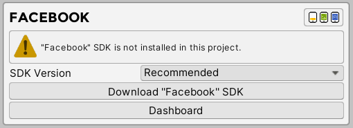
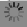
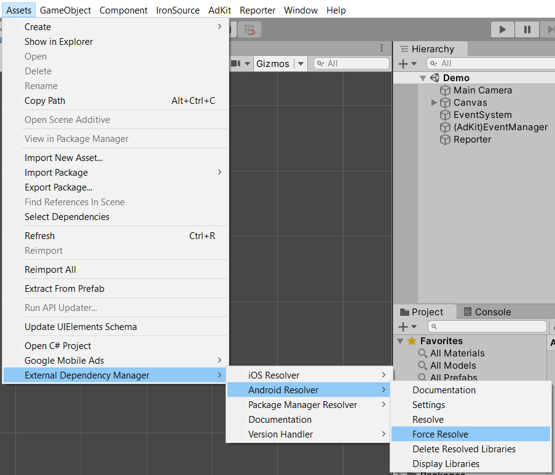

# Facebook

In this section we will explain how to install, enable and use Facebook Audience Network Ads with AdKit plugin. We will explain in detail on how to create new project in the Facebook Audience Network dashboard and how to synchronize with the plugin.

!> **Prerequisites:**  
•	Registered Facebook account  
•	Active Facebook business manager account

## Installation

1. Select preferred SDK version:
  1. Recommended – this version is tested by our developers. Version is fully compatible with our plugin and other networks. Recommended version provides more functionality, including separate SDK folder where all recommended SDK will be installed. Also, we’re going to keep up to date the network with each plugin update.
  2. Latest – this version might be the newer version comparing to recommended version. However, this version might not be compatible with the current AdKit version. Only use this version if there is a need for it.

2. When SDK version has been selected press “Download SDK” button to download the plugin. In the top right corner ad formats, which are available in this plugin, are displayed:
  1. Yellow – banner ad.
  2. Green – interstitial ad.
  3. Blue – rewarded ad.

3. After importing the plugin, message with installed plugin will appear. Also, if you choose to download recommended version, next to the header will be displayed SDK version and “Uninstall SDK” button at the bottom which will allow you to quickly delete installed SDK.
  1. Version – which version is currently installed (Recommended version only).
  2. Available Ad Formats – which ad formats are available. After enabling specific ad format, specific icon will become colored.
  3. Active SDK – enable or disable SDK from AdKit plugin.
  4. Uninstall SDK – uninstall network from plugin. (Recommended version only).
  5. Dashboard – opens Unity Ads online dashboard.

4. Enable plugin and wait couple seconds for Unity Editor to finish loading files.

5. After plugin loading finished message with installed and enabled plugin will be displayed.
  1. Test Mode – Facebook Audience Network provides test mode for each ad format. Enable it if you want to display test ads while developing.
  2. Banner Ads Active – if enabled,Facebook Audience Network will be active to select for mediation in banner profiles.
  3. Interstitial Ads Active – if enabled, Facebook Audience Network  will be active to select for mediation in interstitial profiles.
  4. Rewarded Ads Active – if enabled, Facebook Audience Network will be active to select for mediation in rewarded profiles.

6. ~(Android)~ Navigate to “Assets” and now select “External Dependency Manager”, expand “Android Resolver” and select “Force Resolve” button.

## New Project

In this section we will explain how to create project using Facebook Audience Network dashboard and how to synchronize all IDs with the plugin.

1. Visit [https://developers.facebook.com](https://developers.facebook.com)
2. Expand “My Apps” and select “Create App” button.

3.	Fill in “Display Name” and “Contact Email” fields.

4.	In the new page find “Audience Network” section and press “Set Up” button.

5.	Select your Business Manager account and click “Next”.

6.	Fill in “Property name” field and select “Next”.

7.	Navigate to right toolbar. Expand “Integration” and select “Properties” button.

8.	In the following page select project property.

9.	Select one of the following platforms.

10.	If the project is already published on Google Play Store or Apple App Store, then select “App is live” and enter store link. If the project is not published, then select “App is not live”. If you are planning to use more than one network in your project, then check “This app is using mediation” property and click “Submit” button.

11.	Navigate to right toolbar. Expand “Integration” and select “Properties” button.

12.	In the following page select project property.

13.	Press “+ Create Ad Space” button.

14.	Fill in “Name” field and provide brief explanation about your project and where ads will be shown. After providing description, select “Create Ad Space” button.

## Banner Ads‎‎‏‏‎‏‏‎ ‎

In this section we will explain how to create banner ad in Facebook Audience Network dashboard and then synchronize it with AdKit Plugin. 

1.	Navigate to right toolbar. Expand “Integration” and select “Properties” button.

2.	In the following page select project property.

3.	Select Ad Space.

4.	Press “+ Create Placement”.

5.	Fill in “Placement name” field.

6.	Select Banner placement.

7.	Press “Create Placement” button.

8.	Banner ads has been created. Do not forget to copy ID.

9.	Navigate back to Unity Editor and enable “Banner Ads Active”. Fill in “Banner ID” field with ID that has been created in Facebook Audience Network dashboard.

## Interstitial Ads

In this section we will explain how to create interstitial ad in Facebook Audience Network dashboard and then synchronize it with AdKit Plugin. 

1.	Navigate to right toolbar. Expand “Integration” and select “Properties” button.

2.	In the following page select project property.

3.	Select Ad Space.

4.	Press “+ Create Placement”.

5.	Fill in “Placement name” field.

6.	Select Interstitial placement.

7.	Press “Create Placement” button.

8.	Interstitial ads have been created. Do not forget to copy ID.

9.	Navigate back to Unity Editor and enable “Interstitial Ads Active”. Fill in “Interstitial ID” field with ID that has been created in Facebook Audience Network dashboard.

## Rewarded Ads

In this section we will explain how to create rewarded ad in Facebook Audience Network dashboard and then synchronize it with AdKit Plugin. 

1.	Navigate to right toolbar. Expand “Integration” and select “Properties” button.

2.	In the following page select project property.

3.	Select Ad Space.

4.	Press “+ Create Placement”.

5.	Fill in “Placement name” field.

6.	Select Rewarded placement.

7.	Press “Create Placement” button.

8.	Rewarded ads have been created. Do not forget to copy ID.

9.	Navigate back to Unity Editor and enable “Rewarded Ads Active”. Fill in “Rewarded ID” field with ID that has been created in Facebook Audience Network dashboard.

