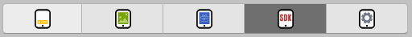
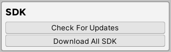

# SDK

In this section we are going to explain how to install and setup ad networks for AdKit plugin. Each network has its own section where all changes can be done. Some networks require External Dependency Manager which also will be provided.

1. Open AdKit manager and select “SDK” tab.

2. In the SDK section you can check if there is any new updates for imported networks or download all ad networks at once.

