# AdMob

In this section we will explain how to install, enable and use AdMob with AdKit plugin. We will explain in detail on how to create new project in the AdMob dashboard and how to synchronize with the plugin.

!> **Prerequisites:**  
•	Registered AdMob account  
•	(iOS) Installed CocoaPods

## Installation

1. Select preferred SDK version:
  1. Recommended – this version is tested by our developers. Version is fully compatible with our plugin and other networks. Recommended version provides more functionality, including separate SDK folder where all recommended SDK will be installed. Also, we’re going to keep up to date the network with each plugin update.
  2. Latest – this version might be the newer version comparing to recommended version. However, this version might not be compatible with the current AdKit version. Only use this version if there is a need for it.

2. When SDK version has been selected press “Download SDK” button to download the plugin. In the top right corner ad formats, which are available in this plugin, are displayed:
  1. Yellow – banner ad.
  2. Green – interstitial ad.
  3. Blue – rewarded ad.

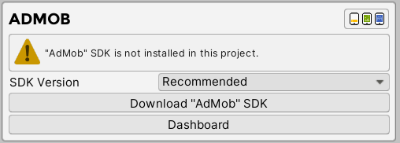

3. After importing the plugin, message with installed plugin will appear. Also, if you choose to download recommended version, next to the header will be displayed SDK version and “Uninstall SDK” button at the bottom which will allow you to quickly delete installed SDK.
  1. Version – which version is currently installed. (Recommended version only).
  2. Available Ad Formats – which ad formats are available. After enabling specific ad format, specific icon will become colored.
  3. Active SDK – enable or disable SDK from AdKit plugin.
  4. Uninstall SDK – uninstall network from plugin. (Recommended version only).
  5. Dashboard – opens Unity Ads online dashboard.

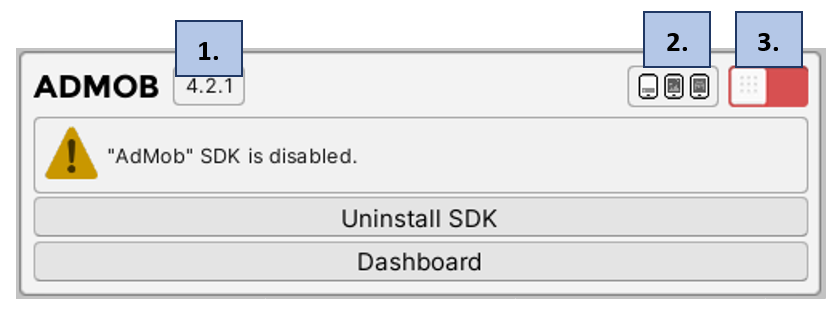

4. Enable plugin and wait couple seconds for Unity Editor to finish loading files.

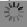

5. After plugin loading finished message with installed and enabled plugin will be displayed.
  1. Test Mode – AdMob provide test mode for each ad format. Enable it if you want to display test ads while developing.
  2. Banner Ads Active – if enabled, AdMob network will be active to select for mediation in banner profiles.
  3. Interstitial Ads Active – if enabled, AdMob network will be active to select for mediation in interstitial profiles.
  4. Rewarded Ads Active – if enabled, AdMob network will be active to select for mediation in rewarded profiles.

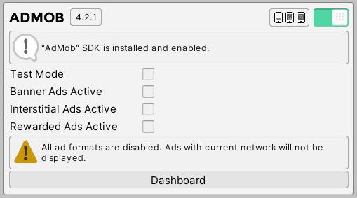

6. ~(Android)~ Navigate to “Assets” and now select “External Dependency Manager”, expand “Android Resolver” and select “Force Resolve” button.

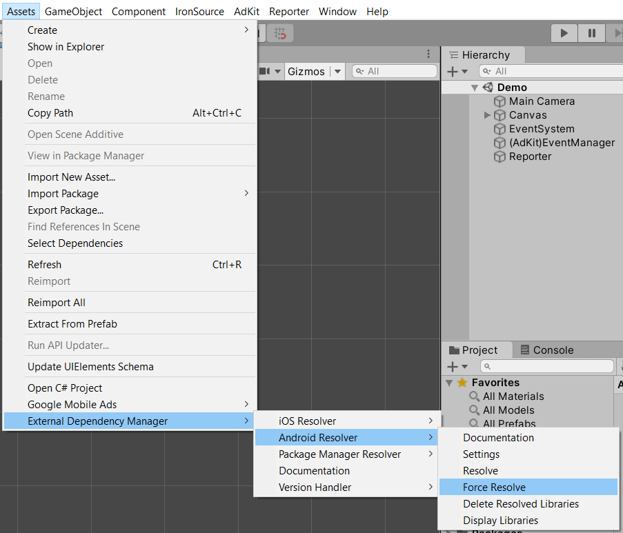

## New Project

In this section we will explain how to create project using AdMob dashboard and how to synchronize all IDs with the plugin.

1. Visit [https://apps.admob.com](https://apps.admob.com)
2. On the left toolbar select “Apps” and click on “Add App” button.

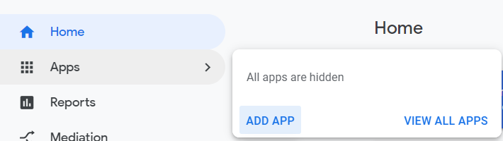

3. If the project is already published on Google Play Store or Apple App Store, then select “Yes” button. After that, you will have to provide link to the project. If the project is not published, then select “No”.

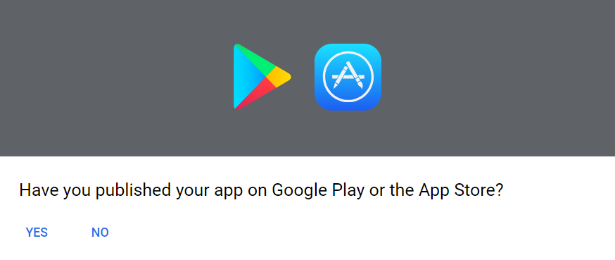

4. Enter project name and select platform on which project is developed. If you want to receive analytics from AdMob, then enable user metrics and click “Add” button. (If project is developed on both platforms, select first platform, and later create new project with second platform).

?> **Quick Tip:**  
•	If project is developed on both platforms, then name first project “Game (Android)” and second one “Game(iOS)”. This will help you to distinguish easier both projects.

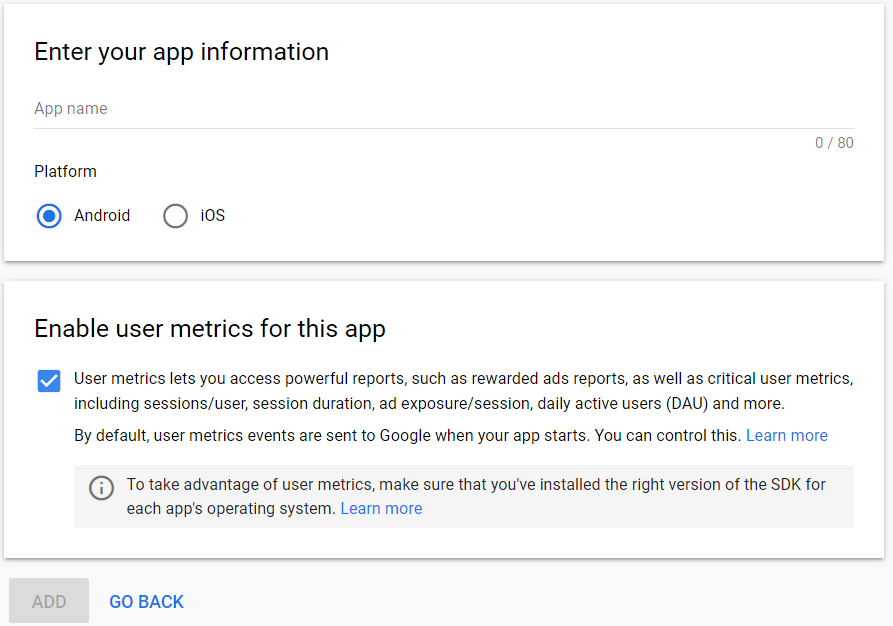

5. In the new page message about created project will appear.

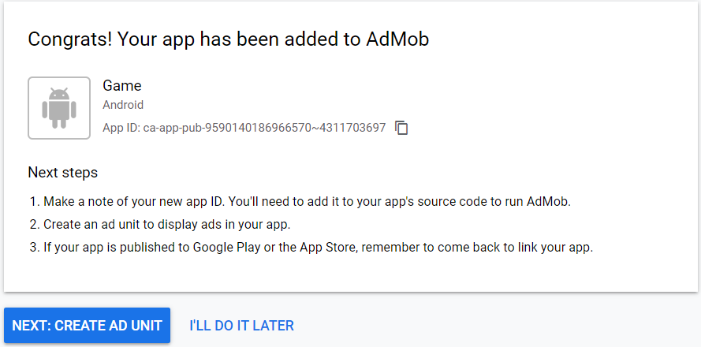

6. Copy App ID and come back to Unity Editor. Then navigate to “Assets” expand “Google Mobile Ads” and select “Settings” field.

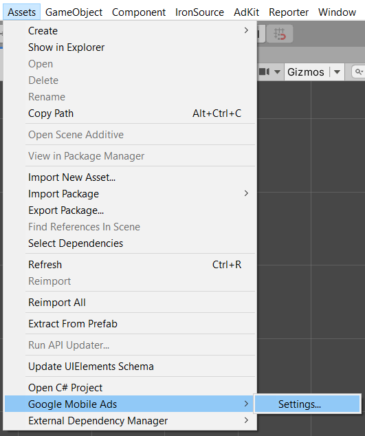

7. In the opened window enable “Google AdMob” and fill in Android or iOS field.

?> **Quick Tip:**  
•	If you are planning to launch on both Android and iOS, then you will need to fill in both fields.

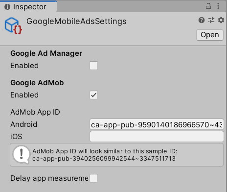

## Banner Ads‎‎‏‏‎‏‏‎ ‎

In this section we will explain how to create banner ad in AdMob dashboard and then synchronize it with AdKit Plugin.

1. Open project and select “Ad Unit” button.

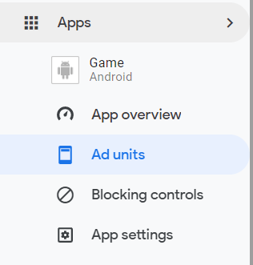

2. In the new page if you have not created any ad units select “Get Started”. If you have created ad units, then select “Add Ad Unit”.

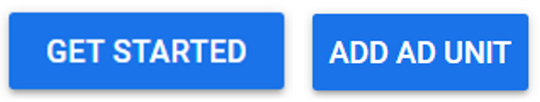

3.	Find banner section and press “Select” button.

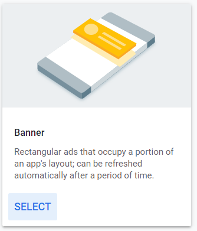

4.	Fill “Ad unit name” field and press “Create Ad Unit” button.

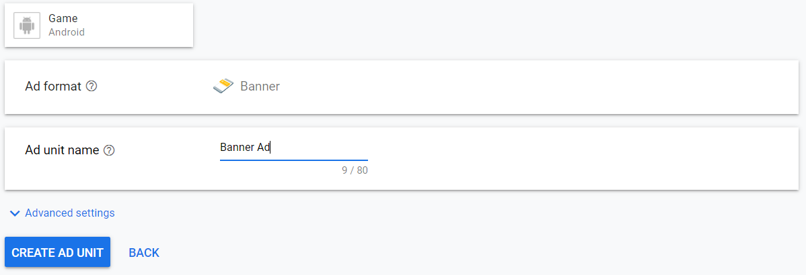

5.	Copy both, app and unit IDs and select “Done” button.

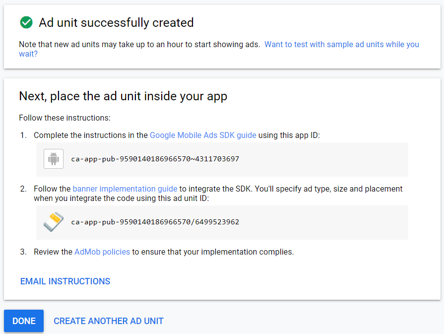

6.	Go back to Unity Editor and enable “Banner Ads Active”. Fill in “App ID” (If you haven’t done yet) and “Banner Unit ID” fields with provided IDs from AdMob Dashboard.

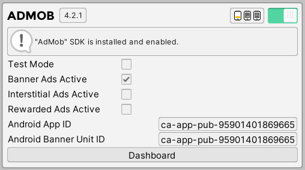

## Interstitial Ads

In this section we will explain how to synchronize default AdMob interstitial ad with AdKit Plugin.

1.	Open project and select “Ad Unit” button.

2.	In the new page if you have not created any ad units select “Get Started”. If you have created ad units, then select “Add Ad Unit”.

3.	Find interstitial section and press “Select” button.

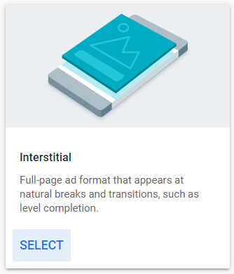

4.	Fill “Ad unit name” field and press “Create Ad Unit” button.

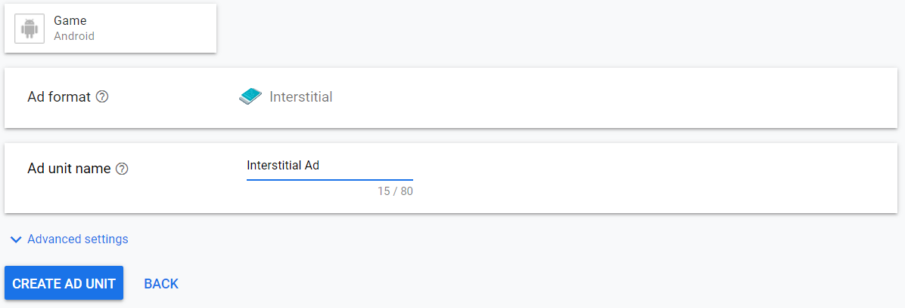

5.	Copy both, app and unit IDs and select “Done” button.

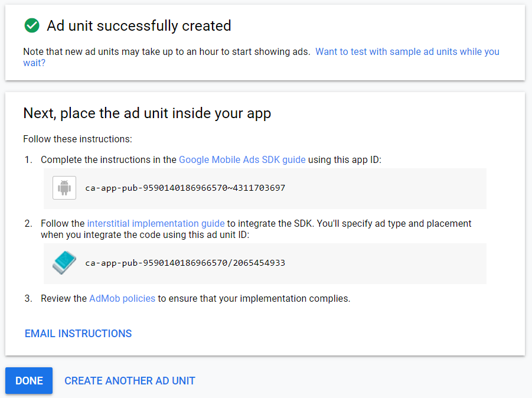

6.	Go back to Unity Editor and enable “Interstitial Ads Active”. Fill in “App ID” (If you haven’t done yet) and “Interstitial Unit ID” fields with provided IDs from AdMob Dashboard.

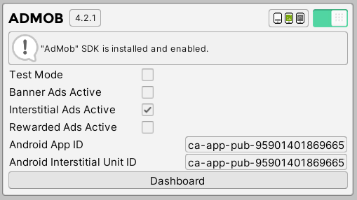

## Rewarded Ads

In this section we will explain how to synchronize default AdMob rewarded ad with AdKit Plugin.

1.	Open project and select “Ad Unit” button.

2.	In the new page if you have not created any ad units select “Get Started”. If you have created ad units, then select “Add Ad Unit”.

3.	Find rewarded section and press “Select” button.

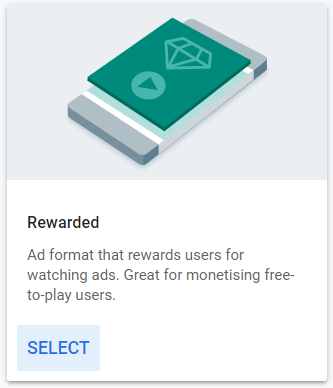

4.	Fill “Ad unit name” field and press “Create Ad Unit” button.

5.	Copy both, app and unit IDs and select “Done” button.

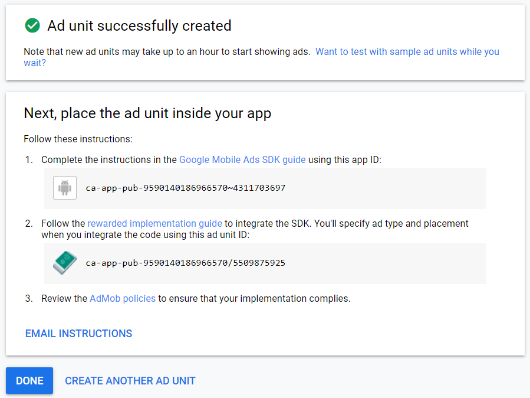

6.	Go back to Unity Editor and enable “Rewarded Ads Active”. Fill in “App ID” (If you haven’t done yet) and “Rewarded Unit ID” fields with provided IDs from AdMob Dashboard.

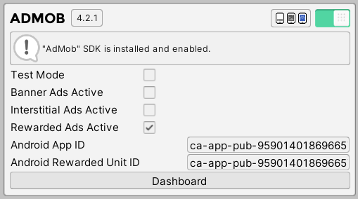