# IronSource

In this section we will explain how to install, enable and use IronSource Ads with AdKit plugin. We will explain in detail on how to create new project in the IronSource dashboard and how to synchronize with the plugin.

!> **Prerequisites:**  
•	Registered IronSource account  
•	(iOS) Installed CocoaPods

## Installation

1. Select preferred SDK version:
  1. Recommended – this version is tested by our developers. Version is fully compatible with our plugin and other networks. Recommended version provides more functionality, including separate SDK folder where all recommended SDK will be installed. Also, we’re going to keep up to date the network with each plugin update.
  2. Latest – this version might be the newer version comparing to recommended version. However, this version might not be compatible with the current AdKit version. Only use this version if there is a need for it.

2. When SDK version has been selected press “Download SDK” button to download the plugin. In the top right corner ad formats, which are available in this plugin, are displayed:
  1. Yellow – banner ad.
  2. Green – interstitial ad.
  3. Blue – rewarded ad.

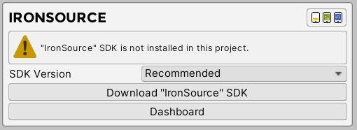

3. After importing the plugin, message with installed plugin will appear. Also, if you choose to download recommended version, next to the header will be displayed SDK version and “Uninstall SDK” button at the bottom which will allow you to quickly delete installed SDK.
  1. Version – which version is currently installed (Recommended version only).
  2. Available Ad Formats – which ad formats are available. After enabling specific ad format, specific icon will become colored.
  3. Active SDK – enable or disable SDK from AdKit plugin.
  4. Uninstall SDK – uninstall network from plugin. (Recommended version only).
  5. Dashboard – opens Unity Ads online dashboard.

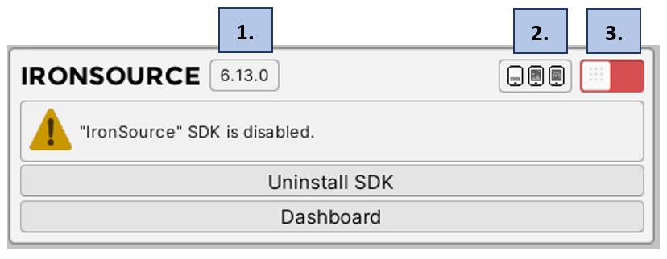

4. Enable plugin and wait couple seconds for Unity Editor to finish loading files.

5. After plugin loading finished message with installed and enabled plugin will be displayed.
  1.	Banner Ads Active – if enabled, IronSource network will be active to select for mediation in banner profiles.
  2.	Interstitial Ads Active – if enabled, IronSource network will be active to select for mediation in interstitial profiles.
  3.	Rewarded Ads Active – if enabled, IronSource network will be active to select for mediation in rewarded profiles.

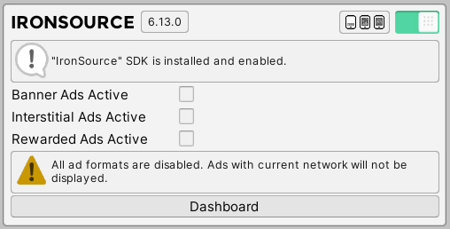

6. ~(Android)~ Navigate to “Assets” and now select “External Dependency Manager”, expand “Android Resolver” and select “Force Resolve” button.

## New Project

In this section we will explain how to create project using IronSource dashboard and how to synchronize all IDs with the plugin.

1.	Visit [https://platform.ironsrc.com](https://platform.ironsrc.com)
2.	Select “New App” button.

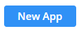

3.	If the project is already live on Google Play Store or Apple App Store, then select “Mobile App” and provide link to the store. If the project isn’t live, then select “App Not Live in the App Store”. Provide “Temporary Name” and select platform. If the project is developed on both platforms, then later you will need to create second app with another platform. After that select “Add App” button.

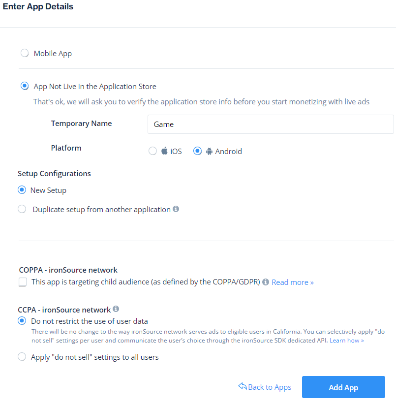

## Banner Ads‎‎‏‏‎‏‏‎ ‎

In this section we will explain how to create banner ad placement in IronSource dashboard and then synchronize it with AdKit Plugin. 

1.	In the left corner expand “Monetize” field and select “Ad Units & Placements”.

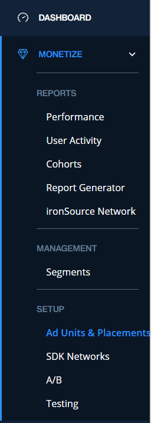

2.	Find and select the app.

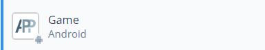

3.	Select “Banner” field in the top toolbar. We will use default banner ad placement which has been already created. Copy “App Key” which is located in top left corner and “Placement Name”.

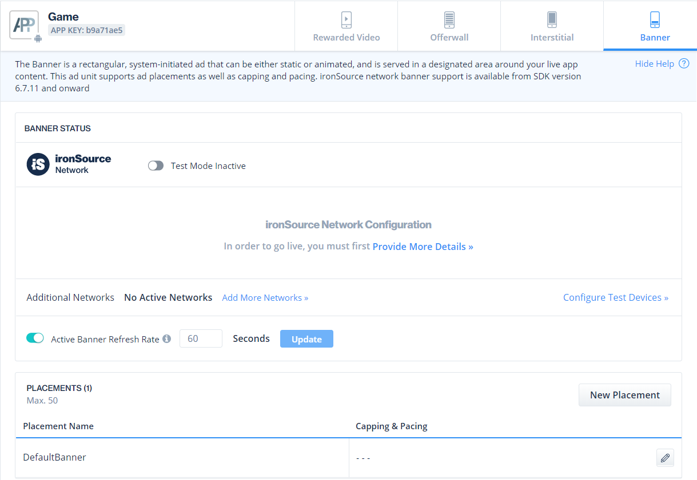
 
4.	Enable test mode if you want to display test ads while developing.
 
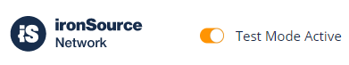

5.	Navigate back to Unity Editor and enable “Banner Ads Active”. Fill in “App ID” (If you haven’t done yet) and “Banner ID” field with ID that has been created in IronSource dashboard.

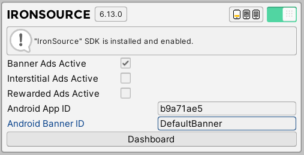

## Interstitial Ads

In this section we will explain how to create interstitial ad placement in IronSource dashboard and then synchronize it with AdKit Plugin. 

1.	In the left corner expand “Monetize” field and select “Ad Units & Placements”.

2.	Find and select the app.

 
3.	Select “Interstitial” field in the top toolbar. We will use default interstitial ad placement which has been already created. Copy “App Key” which is located in top left corner and “Placement Name”.

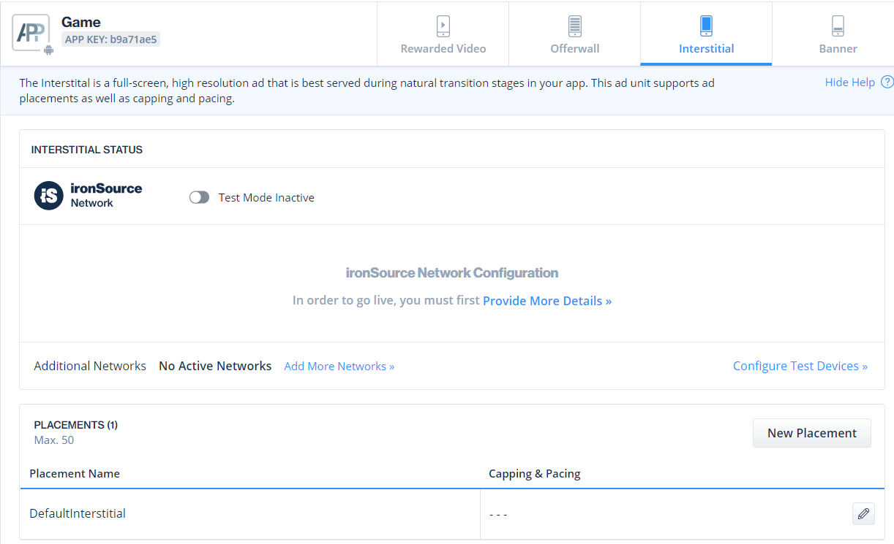

4.	Enable test mode if you want to display test ads while developing.
 

5.	Navigate back to Unity Editor and enable “Interstitial Ads Active”. Fill in “App ID” (If you haven’t done yet) and “Interstitial ID” field with ID that has been created in IronSource dashboard.

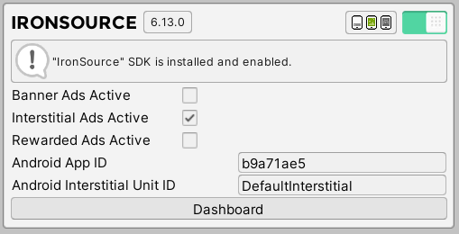

## Rewarded Ads

In this section we will explain how to create rewarded ad placement in IronSource dashboard and then synchronize it with AdKit Plugin. 

1.	In the left corner expand “Monetize” field and select “Ad Units & Placements”.
 

2.	Find and select the app.

 
3.	Select “Rewarded” field in the top toolbar. We will use default rewarded ad placement which has been already created. Copy “App Key” which is located in top left corner and “Placement Name”.
 
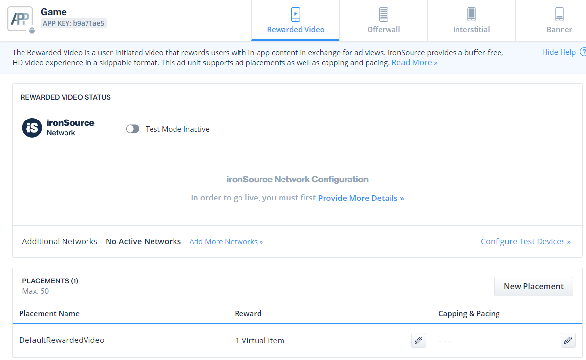

4.	Enable test mode if you want to display test ads while developing.
 

5.	Navigate back to Unity Editor and enable “Rewarded Ads Active”. Fill in “App ID” (If you haven’t done yet) and “Rewarded ID” field with ID that has been created in IronSource dashboard.

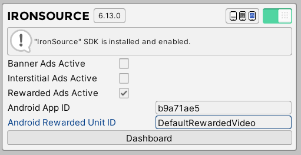