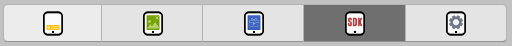
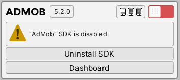
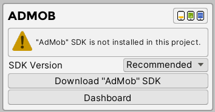
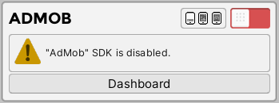
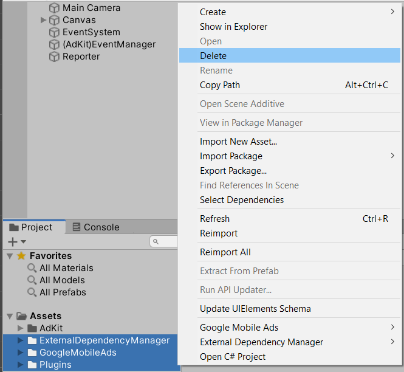
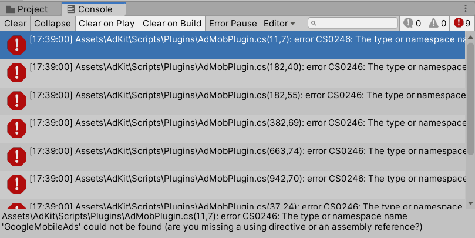
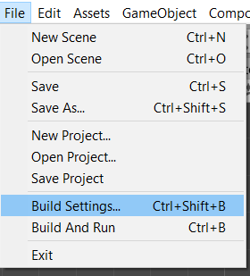
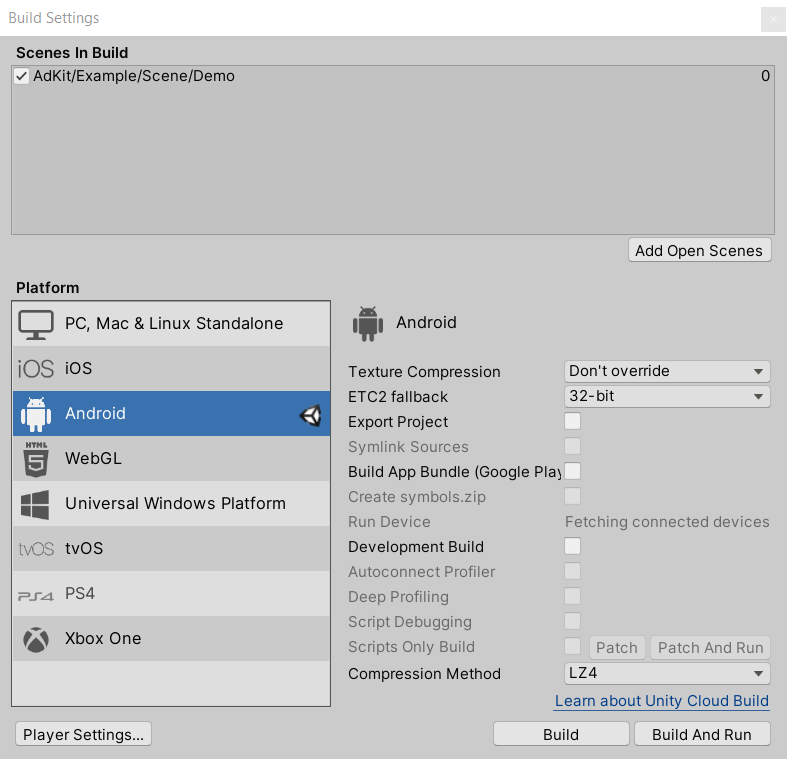
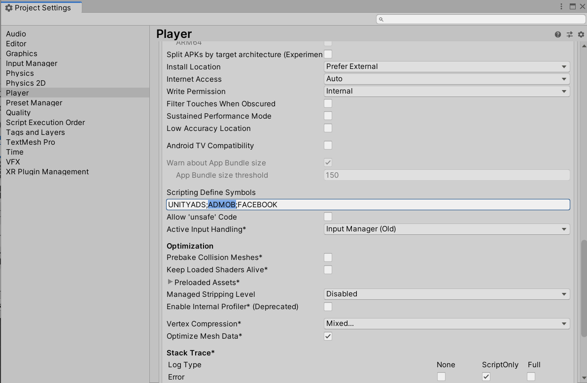

# Uninstall SDK

In this section we will explain how to uninstall unwanted network SDK from the project.

##	Recommended

1.	Navigate to “SDK” menu.

2.	Disable network, which you want to uninstall.

3.	Select “Uninstall SDK” button. Wait couple seconds for Unity to compile the project. After compile is completed network section will change with message that current network SDK is not installed in this project.

##	Outsource

1.	Navigate to “SDK” menu

2.	 Make sure that the network is disabled in the SDK menu.

3.	Delete network files from project.

4.	If you are getting errors, it means that scripting define symbols has not been removed correctly from the project.

5.	Navigate to File/Build Settings

6.	Select “Player Settings” button

7.  Scroll down and find “Scripting Define Symbols” field. Remove deleted network name from the list.

?> **Quick Tip:**  
•	Make sure that each network name is separated with semicolon ( ; )

8.  Wait couple seconds for Unity to compile the project. After compile is completed network section will change with message that current network SDK is not installed in this project.

