# Unity Ads

In this section we will explain how to install, enable and use Unity Ads with AdKit plugin. We will explain in detail on how to create new project in the Unity Ads dashboard and how to synchronize it with the plugin.

!> **Prerequisites:**  
• Registered Unity Ads account

## Installation

1. Select preferred SDK version:
  1. Recommended – this version is tested by our developers. Version is fully compatible with our plugin and other networks. Recommended version provides more functionality, including separate SDK folder where all recommended SDK will be installed. Also, we’re going to keep up to date the network with each plugin update.
  2. Latest – this version might be the newer version comparing to recommended version. However, this version might not be compatible with the current AdKit version. Only use this version if there is a need for it.

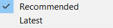

2. When SDK version has been selected press “Download SDK” button to download the plugin. In the top right corner ad formats, which are available in this plugin, are displayed:
  1. Yellow – banner ad.
  2. Green – interstitial ad.
  3. Blue – rewarded ad.

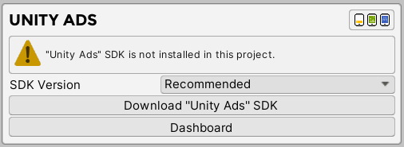

3. After importing the plugin, message with installed plugin will appear. Also, if you choose to download recommended version, next to the header will be displayed SDK version and “Uninstall SDK” button at the bottom which will allow you to quickly delete installed SDK.
  1. Version – which version is currently installed (Recommended version only).
  2. Available Ad Formats – which ad formats are available. After enabling specific ad format, specific icon will become colored.
  3. Active SDK – enable or disable SDK from AdKit plugin.
  4. Uninstall SDK – uninstall network from plugin. (Recommended version only).
  5. Dashboard – opens Unity Ads online dashboard.

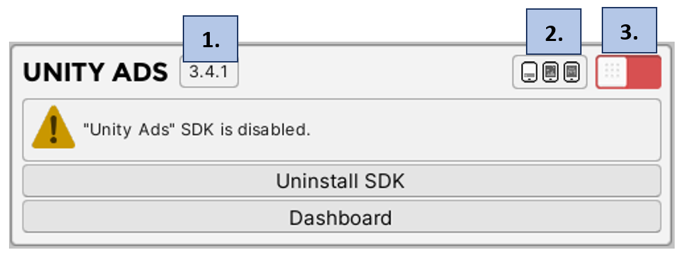

4. Enable plugin and wait couple seconds for Unity Editor to finish loading files.

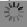

5. After plugin loading finished message with installed and enabled plugin will be displayed.
  1. Test Mode – Unity ads provide test mode for each ad format. Enable it if you want to display test ads while developing.
  2. Banner Ads Active – if enabled, Unity Ads network will be active to select for mediation in banner profiles.
  3. Interstitial Ads Active – if enabled, Unity Ads network will be active to select for mediation in interstitial profiles.
  4. Rewarded Ads Active – if enabled, Unity Ads network will be active to select for mediation in rewarded profiles.

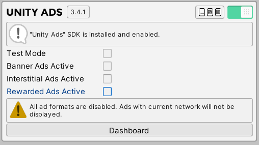

## New Project

In this section we will explain how to create project using Unity Ads Online Dashboard and how to synchronize all IDs with the plugin.

1. Visit [https://operate.dashboard.unity3d.com](https://operate.dashboard.unity3d.com)
2. In the top right corner select “New Project” Button.

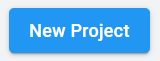

3. Fill project name field. (If the project is already launched on Apple App store or Google Play store, then fill appropriate fields) And select “Add project” button.

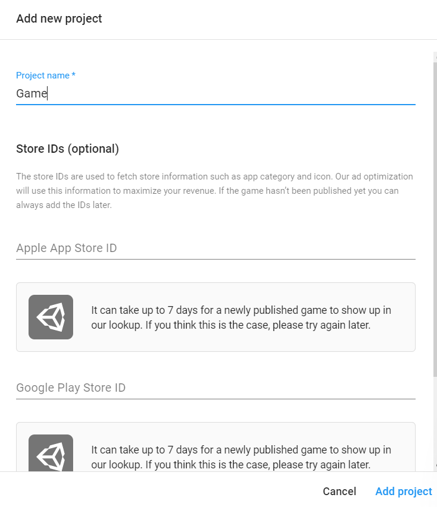

4. After creating new project, navigate to the toolbar and expand “Monetization”. Select “Placements” button.

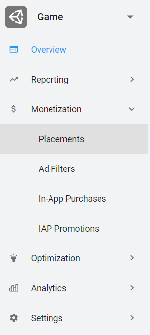

5. In the new page you will find project Game IDs. Do not forget them, we will use them later in the project.

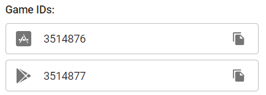  

## Banner Ads‎‎‏‏‎‏‏‎ ‎

In this section we will explain how to create banner ad in Unity Ads dashboard and then synchronize it with AdKit Plugin.

1. In “Placements” page select “Add Placement” button.

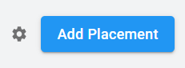

2. Fill in “Placement ID” field and select Banner placement type. In the end, click “Create placement” button.

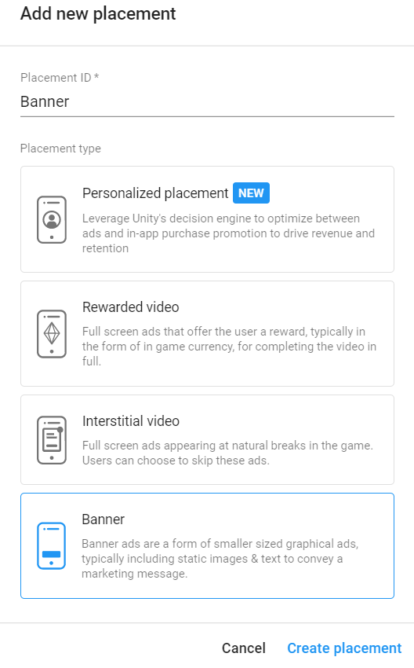

3. Remember banner placement ID. Return to Unity Editor and enable “Banner Ads Active” toggle. Fill in “Game ID” field (if you haven’t done yet) and “Banner Placement ID” field.

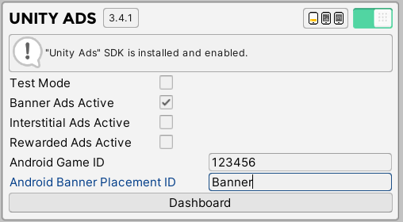

## Interstitial Ads

In this section we will explain how to synchronize default Unity Ads interstitial ad with AdKit Plugin.

1. In “Placements” page find “video” ad placement. This is Unity Ads default interstitial ad – video which has action to skip after 5 seconds.

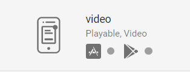

2. Remember interstitial placement ID. Return to Unity Editor and enable “Interstitial Ads Active” toggle. Fill in “Game ID” field (if you haven’t done yet) and “Interstitial Placement ID” field.

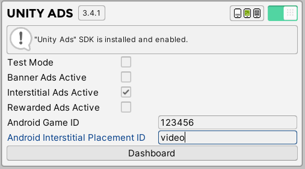

## Rewarded Ads

In this section we will explain how to synchronize default Unity Ads rewarded ad with AdKit Plugin.

1. In “Placements” page find “rewardedVideo” ad placement. This is Unity Ads default rewarded ad – non-skippable rewarded video ad.

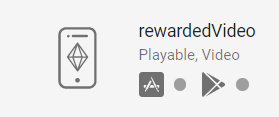

2. Remember rewarded placement ID. Return to Unity Editor and enable “Rewarded Ads Active” toggle. Fill in “Game ID” field (if you haven’t done yet) and “Rewarded Placement ID” field.

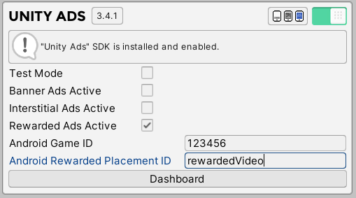